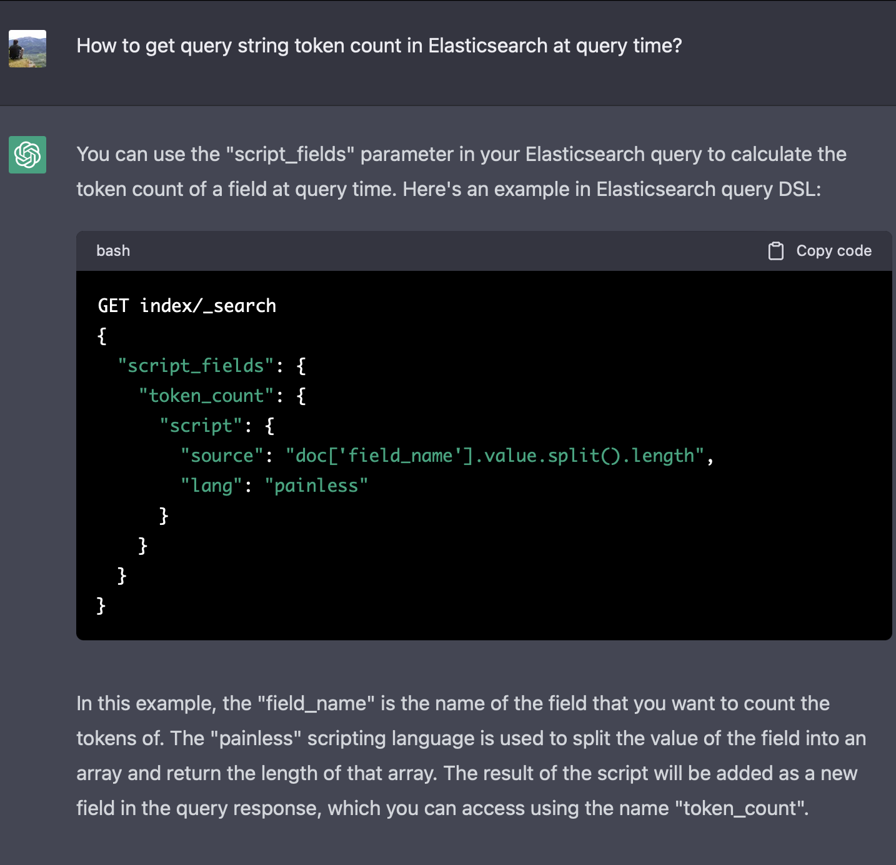

## Intro

Recently I've done a little Elasticsearch-based demo where there was one requirement I believe is worth sharing: the entire text should match even if two words are swapped.
This post is divided into two parts: requirements for a demo, and several implementation options.

## Requirements

A simplified version of relevant requirements goes something like this:

1. Documents are chat app message bodies,
2. Match a message body with other messages even if any two words were swapped.

E.g. a message `this is my message` should match `is this my message` and vice versa.

At first, this looks like nothing fancy, just set up an [analyzer](https://www.elastic.co/guide/en/elasticsearch/reference/current/analysis-analyzers.html) with the required [token filters](https://www.elastic.co/guide/en/elasticsearch/reference/current/analysis-tokenfilters.html`) and do a [phrase_match query](https://www.elastic.co/guide/en/elasticsearch/reference/current/query-dsl-match-query-phrase.html) with a `slop=2`.

But then comes the tricky bit: we also need to take into account the **length of the message**.
This is because a `phrase_match` with a short message will match longer messages.
E.g. We don't want that the query `is this my message` would match `this is my message which is longer`.

## Implementation strategies

We'll discuss two implementation strategies: fingerprinting based on the token count and a clever trick leveraging the text analysis pipeline.

### Fingerprint

An instinctive approach is to [fingerprint](https://www.elastic.co/guide/en/elasticsearch/reference/master/fingerprint-processor.html) the message text. 
The simplest fingerprint could just be the count of tokens. 
Elasticsearch conveniently offers a [token count field type](https://www.elastic.co/guide/en/elasticsearch/reference/current/token-count.html).

One serious downside of this approach is that at the query time we'd have to get the count of tokens of the query.
This means either one additional round-trip to Elasticsearch to get the token count, e.g. using the [`_analyze` API](https://www.elastic.co/guide/en/elasticsearch/reference/current/indices-analyze.html) or use of a `script` in the query.
Let's rule out the round trip to the `_analyze` API approach for the demo.
Then how to implement the `script` to get query token count?
The [Chat GPT](https://chat.openai.com/chat#) gave me a hint at a possible `script` based solution :)



A significant problem with the above approach is that the text is split by a whitespace character (or something that [`split`](https://docs.oracle.com/javase/8/docs/api/java/util/regex/Pattern.html#split%2Djava.lang.CharSequence%2D) accepts).
Any seasoned search engineer immediately notices that the text is not tokenized by the same analyzer that was used to tokenize the text during the index-time for the token counting.
Of, course we could set up both `tokenizers` to work the same way, but that approach seems somewhat fragile because part of the logic is in the index mapping and the other part is in the script that lives in the query constructor which is probably inside your application.

### Clever Text Analysis

We could also be more clever about how to ensure that the length of the matched texts is equal.
My strategy is to require both conditions to be true:
1. Match the text **from the beginning of the string** with a `phrase_match` query with a slop=2.
2. Match the **reversed** text from the beginning of the string with a `phrase_match` query with a slop=2.

The strategy requires us to solve 2 puzzles:
1. How to match exactly from the beginning of the text?
2. How to reverse the text?

To ensure the matching from the beginning we could insert a synthetic `PREFIX` token at the position 0.[^reverse]

For the text reversal the idea is to:
1. Use the [keyword tokenizer](https://www.elastic.co/guide/en/elasticsearch/reference/current/analysis-keyword-tokenizer.html)
2. Use the [reverse](https://www.elastic.co/guide/en/elasticsearch/reference/current/analysis-reverse-tokenfilter.html) token filter on the entire text,
3. Split the text into tokens using the [word delimiter graph token filter](https://www.elastic.co/guide/en/elasticsearch/reference/current/analysis-word-delimiter-graph-tokenfilter.html#analysis-word-delimiter-graph-tokenfilter).
4. Add a synthetic token at the position 0.

Let's work out an example from requirements: `this is my message` should match `is this my message` but should not match `this is my message which is longer`.

The `messages` index config[^analysis]:
```json
{
  "settings": {
    "number_of_replicas": 0,
    "number_of_shards": 1,
    "analysis": {
      "analyzer": {
        "normal_direction_analyzer": {
          "type": "custom",
          "tokenizer": "keyword",
          "filter": [
            "token_splitter",
            "prefixer"
          ]
        },
        "backwards_direction_analyzer": {
          "type": "custom",
          "tokenizer": "keyword",
          "filter": [
            "reverse",
            "token_splitter",
            "prefixer"
          ]
        }
      },
      "filter": {
        "token_splitter": {
          "type": "word_delimiter_graph",
          "split_on_case_change": false,
          "split_on_numerics": false
        },
        "inject_prefix": {
          "type": "pattern_replace",
          "pattern": "^(.*)$",
          "replacement": "PREFIX $1"
        },
        "prefixer": {
          "type": "condition",
          "filter": [
            "inject_prefix",
            "token_splitter"
          ],
          "script": {
            "source": "token.getPosition() == 0"
          }
        }
      }
    }
  },
  "mappings": {
    "properties": {
      "body": {
        "type": "text",
        "fields": {
          "normal_direction": {
            "type": "text",
            "analyzer": "normal_direction_analyzer"
          },
          "backwards_direction": {
            "type": "text",
            "analyzer": "backwards_direction_analyzer"
          }
        }
      }
    }
  }
}
```

Let's index 2 documents:
```text
POST _bulk?refresh=true
{ "index" : { "_index" : "messages", "_id" : "1" } }
{ "body": "this is my message" }
{ "index" : { "_index" : "messages", "_id" : "2" } }
{ "body": "this is my message which is longer" }
```

Let's query the `messages` index:
```json
{
  "query": {
    "bool": {
      "must": [
        {
          "match_phrase": {
            "body.normal_direction": {
              "query": "is this my message",
              "slop": 2
            }
          }
        },
        {
          "match_phrase": {
            "body.backwards_direction": {
              "query": "is this my message",
              "slop": 2
            }
          }
        }
      ],
      "_name": "full phrase with accounted length"
    }
  }
}
```

The response:
```json
{
  "took": 2,
  "timed_out": false,
  "_shards": {
    "total": 1,
    "successful": 1,
    "skipped": 0,
    "failed": 0
  },
  "hits": {
    "total": {
      "value": 1,
      "relation": "eq"
    },
    "max_score": 0.46947598,
    "hits": [
      {
        "_index": "messages",
        "_id": "1",
        "_score": 0.46947598,
        "_source": {
          "body": "this is my message"
        },
        "matched_queries": [
          "full phrase with accounted length"
        ]
      }
    ]
  }
}
```

The response is exactly as expected: it does match the shorter but not the longer message body.

Downsides of the approach:
- The text is indexed 2 times. But it is acceptable to index and analyze the text in multiple ways, e.g. stemming.
- Analyzers got somewhat complicated. But the complicated bit is isolated only for dealing with the first token. Also, a couple of examples with the `_analyze` API should make the analysis pipeline understandable. 
- The total text length is limited to the `Integer.MAX_VALUE` which is 2147483647 characters. But ~2 GB per message should be enough.
- "Tokenization" is done with the `word_delimiter_graph`. But it is a standard [Lucene](https://lucene.apache.org) feature that you should learn anyway.
- Also, all the gotchas of the `slop` are relevant, e.g. if one token was dropped/added from/to the query, then there still would be a match.

A nice thing is that this solution is contained within the text analysis pipeline: no ingest pipelines, no scripting in queries, etc.

## Summary

In this post we've defined a problem of matching entire text with some flexibility in terms of token position changes.
We've discussed 2 approaches: fingerprinting and leveraging text analysis pipeline to account for the text length.
IMO, both approaches are somewhat hacky and have their downsides.
I've picked to work out the text analysis approach, and I've got my demo done.

Let me know how you would approach this problem in the comments below.

## Footnotes

[^analysis]: lowercasing and ascii-folding are omitted for brevity.
[^reverse]: Of course, I've been thinking about leveraging [`span_first`](https://www.elastic.co/guide/en/elasticsearch/reference/current/query-dsl-span-first-query.html) query, but it requires another inner term level span query.
Which would make the query construction complicated because tokenization should be done inside your application.
