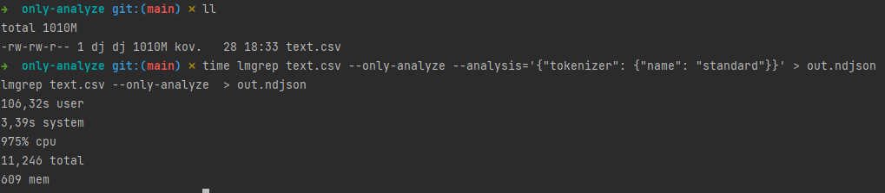

## TL;DR

`lmgrep` provides an easy way to play with various text analysis options.
Just download the `lmgrep` [binary](https://github.com/dainiusjocas/lucene-grep/releases), run it with `--only-analyze`, and observe the list of tokens.

```shell
echo "Dogs and CATS" | lmgrep \
  --only-analyze \
  --analysis='
    {
      "tokenizer": {"name": "standard"},
      "token-filters": [
        {"name": "lowercase"},
        {"name": "englishminimalstem"
      }
    ]
  }'
=>
["dog","and","cat"]
```

## Text Analysis

The [Elasticsearch documentation](https://www.elastic.co/guide/en/elasticsearch/reference/current/analysis.html) describes text analysis as:

> the process of converting unstructured text into a structured format that’s optimized for search.

Therefore, to learn how the full-text search works it is important to understand how the text is, well, analyzed.
The remainder of the post focuses on how text analysis is done in [Lucene](https://lucene.apache.org/) which is the library that powers Elasticsearch and Solr, and what `lmgrep` provides to analyze your text.

# Lucene

Text analysis in the Lucene land is defined by 3 types of components:

- **list** of character filters (changes to the text before tokenization, e.g. HTML stripping, character replacement, etc.),
- **one** tokenizer (splits text into tokens, e.g. at whitespace characters),
- **list** of token filters (normalizes the tokens, e.g. lowercases all the letters).

The particular combination of text analysis components makes an `Analyzer`. 
You can think that an analyzer is a recipe to convert a string into a [graph of text tokens](http://blog.mikemccandless.com/2012/04/lucenes-tokenstreams-are-actually.html). 

## `lmgrep`

`lmgrep` is a search tool that is based on the [Lucene Monitor](https://lucene.apache.org/core/8_2_0/monitor/org/apache/lucene/monitor/Monitor.html) library. 
To do the full-text search it needs to do the same thing that likes of Elasticsearch are doing: to analyze text.
`lmgrep` packs many Lucene text [analysis components](https://github.com/dainiusjocas/lucene-grep/blob/v2021.04.23/docs/analysis-components.md). 
Also, it provides a list of [predefined analyzers](https://github.com/dainiusjocas/lucene-grep/blob/v2021.04.23/docs/predefined-analyzers.md).
No surprises here, the same battle tested components that gets the job done[^2].

However, `lmgrep` provides one clever twist to text analysis: a way to specify an analyzer using plain data in JSON, e.g.:

```shell
echo "<p>foo bars baz</p>" | \
  lmgrep \
  --only-analyze \
  --analysis='
  {
    "char-filters": [
      {"name": "htmlStrip"},
      {
        "name": "patternReplace",
         "args": {
           "pattern": "foo",
           "replacement": "bar"
        }
      }
    ],
    "tokenizer": {"name": "standard"},
    "token-filters": [
      {"name": "englishMinimalStem"},
      {"name": "uppercase"}
    ]
  }
  '
```

Again, no surprises here, just read the docs[^1] of an interesting component, e.g. 
character filter [`patternReplace`](https://lucene.apache.org/core/8_3_0/analyzers-common/org/apache/lucene/analysis/pattern/PatternReplaceCharFilterFactory.html),
add to the `--analysis`, and apply it on your text.

Conceptually it is very similar to what Elasticsearch or Solr are providing: `analysis` part in the index configuration JSON in Elasticsearch, and Solr Schemas in XML. `lmgrep` as of now doesn't provide a way to [share components between analyzers](https://github.com/dainiusjocas/lucene-grep/issues/83). 

All `lmgrep` analysis component has this structure:
```
{"name": "COMPONENT_NAME", "args": {"ARG_NAME": "ARG_VALUE"}}
``` 

NOTE: some components, e.g. `stop` token filter, expect a file as an argument.
To support such components `lmgrep` brutally patched Lucene to support loading data from arbitrary files while preserving the predefined analyzers with, e.g. their stop-words files.

Note: when a predefined analyzer is provided for text analysis then all other analysis components are silently ignored.

Note: predefined analyzers do not support the `args` as of [now](https://github.com/dainiusjocas/lucene-grep/issues/82), just the `name`.

That is pretty much all there is to know about how `lmgrep` does text analysis. Try it out and let me know how it goes. 

### Implementation

All this analyzer construction wizardry is possible because of Lucene's `AbstractAnalysisFactory` class and features provided by its subclasses. The [`CustomAnalyzer`](https://lucene.apache.org/core/8_3_1/analyzers-common/org/apache/lucene/analysis/custom/CustomAnalyzer.html) builder exposes methods that expects a `Class` as an argument, e.g. [`addCharFilter`](https://lucene.apache.org/core/8_3_1/analyzers-common/org/apache/lucene/analysis/custom/CustomAnalyzer.Builder.html#addCharFilter-java.lang.Class-java.util.Map-). The trick here is that, e.g. the class [`TokenFilterFactory`](https://lucene.apache.org/core/7_3_1/analyzers-common/org/apache/lucene/analysis/util/TokenFilterFactory.html) provides a method `availableTokenFilters` that returns a set of `names` of token filters and with those `names` you can get a `Class` object that can be supplied to those `CustomAnalyzer` builder methods.

The discovery of available classes is based on classpath analysis, e.g. fetching all classes whose name matches a pattern like `.*FilterFactory` and are subclasses of a `TokenFilterFactory`. However, for the reasons that were beyond my understanding, when I created my own `TokenFilterFactory` class it was not discovered by Lucene ¯\_(ツ)_/¯.

Yeah, great, but `lmgrep` is compiled with the GraalVM native image which assumes closed-world and throws dynamism of JVM out the window. How then does exactly this TokenFilter thing class discovery works? Yes, Native images must include all the classes because at run-time it cannot create classes, but it can be worked around by providing the configuration with the classes that are going to be used at run-time, and those interesting classes can be reflectively discovered at run-time. `lmgrep` relies on the Java classes being discoverable at compile-time where the dynamism works as expected.

To instruct the `native-image` to discover the Java classes from Clojure code you can specify the class under the regular `def` because to the `native-image` these `def`s look like constants and are evaluated at compiled-time. So, if `lmgrep` missed some awesome Lucene token filter, all it takes is to add it to the hashmap under `def`.

## `--only-analyze`

I like the Elasticsearch's [Analyze API](https://www.elastic.co/guide/en/elasticsearch/reference/current/indices-analyze.html).
It allows me to look at the raw tokens that are either stored in the index or produced from the search query.

To make debugging of `lmgrep` easier I wanted to expose something similar to Analyze API. The `--only-analyze` flag is my humble attempt to do that.

When the flag is specified then `lmgrep` just outputs is a list of tokens that is produced by applying an analyzer on the input text, e.g.:

```shell
echo "the quick brown fox" | lmgrep --only-analyze
=>
["the","quick","brown","fox"]
```

### Implementation 

The machinery under the `--only-analyze` words as follows:
- one thread that reads and decodes the text input (either STDIN or a file),
- one thread that writes to the STDOUT,
- the remaining CPU cores can be used by a thread pool that analyzes the text (thanks to Lucene Analyzer being thread safe).

On my laptop `lmgrep` analyzes ~1GB of text in ~11 seconds and consumes maximum 609 MB of RAM. It should result in ~200 GB of text per hour. IMO, not bad. Of course, the more involved the text analysis is the longer it takes.



Note that the output of `--only-analyze` has the same order as the input. IMO, it makes the output a bit easier to understand. However, it limits the throughput. It is because the time and resources needed to analyze a piece of text can vary greatly and coordination introduces some overhead. 

Consider an example of analyzing the text of a book: assume that first line sent to `lmgrep` is the title of the book, the second line contains a full text of the book, and the third line is the summary. The title is small, it is analyzed and immediately written to STDOUT. The summary is a bit longer but still many times smaller than the body. To preserve the order `lmgrep` before writing the tokens of the summary to STDOUT, waits for the analysis on the body to be finished and written to STDOUT and only then tokens of the summary are written out.

Notes:
- the `explain` flag is coming to `lmgrep`;
- the output lines are valid JSON (so `jq` is your friend);
- the positional arguments for `--only-analyze` are interpreted as files and when present then STDIN is ignored.

### The Clever Bit of `--only-analyze`

One thing that constantly frustrates me with Elasticsearch's Analysis API is that I can't specify details of char filters, tokenizer, and token filter directly in the body of the request to the Analysis API.
To observe the output of text analysis that involves customizable components first I have to create an index with an analyzer and then call Analyze API that involves that index. `lmgrep` avoids this pain point by allowing to declare analysis components that text analysis needs inline.

## Footnotes

[^1]: Just Google for "Lucene <COMPONENT_NAME>" 
[^2]: If something is missing then let me know by creating an issue [here](https://github.com/dainiusjocas/lucene-grep/issues).
