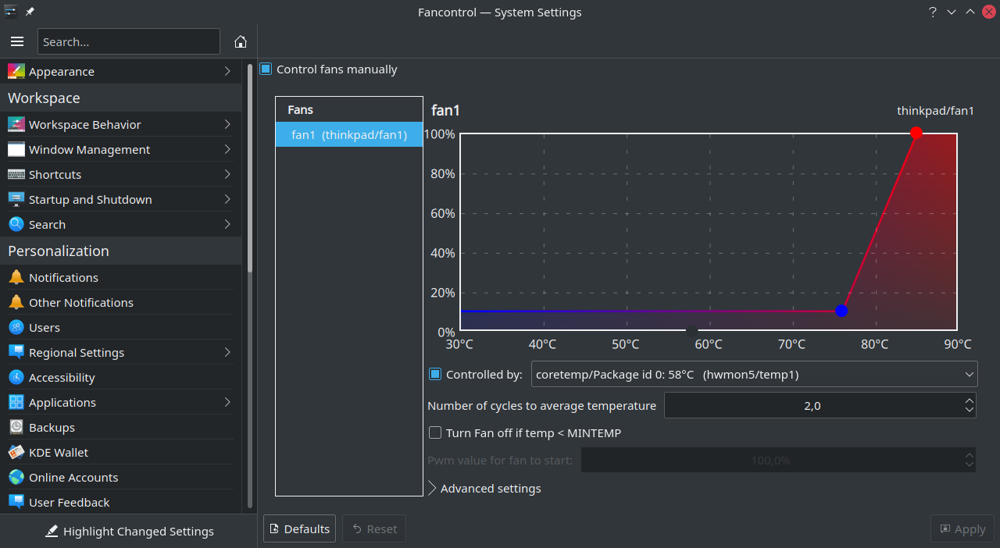
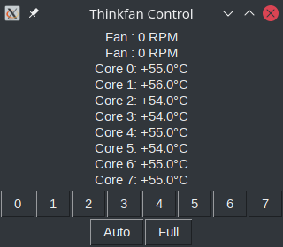
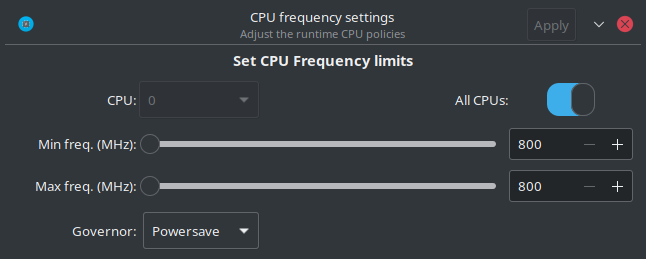
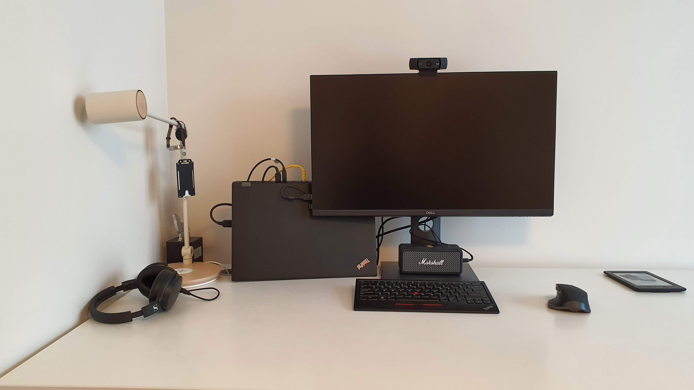

## TL;DR

Lenovo Thinkpad P53 is a powerfull laptop but a regular Linux install is just too loud for me. However, it is just a machine and there must be several control knobs that can make the experience better. In this post I'll share my setup that makes the laptop to be silent most of the time and performant when needed.

## The motivation

To get my daily work done I spin many fat JVMs like Elasticsearch, Kafka, GraalVM native-image tool, Docker compose clusters, VMs, etc. To plow through those tasks a year ago (in 2020) I've got a top spec'ed Lenovo Thinkpad P53 laptop:

| Part | Spec |
|-----:|:----|
|CPU | Intel(R) Core(TM) i9-9880H CPU @ 2.30GHz |
|Memory| 128GB (not a mistake here) |
|Graphics Processor | Nvidia Quadro RTX 4000 |

The laptop(!) can be so power hungry that the charger needs to provide up to 230W(!). Just imagine how loud the fans get when executing computationaly intensive tasks. I simple have to leave the room and close the door until the task is finished.

Anything that is CPU intensive makes the chip hot which spins the fans. By anything here I mean things like regular web browsing (looking at you JIRA), or a simple conference call (looking at you Google Meet and Zoom). I have some doubts that Lenovo have done the best possible job with the fans but I leave that on their concience.

Despite the fact that I run a lot of intensive tasks on a laptop, not all of my tasks are that demanding. Therefore, I want the laptop to be performant when needed (in this case I don't mind it to be loud) and be as silent as possible when that can be achieved. And one additional requirement: I want to work with a Linux machine.

## Prehistory

When I got the laptop the first thing I've done was that I've installed Ubuntu since it is officially supported[^2]. In a very short time I've discovered that at that time it was impossible to silence the laptop to a satisfiable level: Linux just had no drivers that could silence all(!) the fans[^1].

The hope was lost: I had to boot up Windows, setup WSL, and acomodate my development environment there. All because several drivers were missing (sigh). It's worth to mention that I've set up Windows box after a ~10 years of not touching Windows. It was just an OEM install with all the drivers, updates, etc. However, Windows setup had its own problems: for some reason (to me it was not a surprise) Windows 10 could not properly handle the sleep-wake-up cycle (its a laptop after all). But hey, I could disable the Nvidia GPU, then enable it, and everything would be working ok-ish again. I could get stuff done.

However, updating Windows is a thing that can be postponed only that long and when you do an update with a setup that can be seen as being a little bit exotic you might get a broken system that fails to boot up. Yeah, sure, then just run the system fix scripts and you can continue working.

Of course, it doesn't help to have a good experience that it turned out that the laptop arrived with a faulty motherboard that caused all kinds of troubles among which the most painful was random shutdowns. Also, after those shutdowns sometimes even booting up was a real strugle. I guess that poor machine had only the best intentions and was telling me to stop torturing it and by failing to work gave me some well deserved leisure time.

One day the machine after a Windows update really got stuck during the reboot. A blank screen with fans maxed out and no reaction to any button or to power cable unpluging. Several Google searches away and I've discovered that it was a known problem with Thinkpad (not only P53). So, the motherboard got replaced and the laptop got a fair bit more stable.

Also, even Windows that has a supposedly good driver support from everyone (manufacturer, OS) involved has the power consumption and fan control options that are not all that powerfull after all: there are predefined profiles with no manual tunning available. Thats makes me wonder how that software got accepted to be released in the first place.

## The Linux Setup

The news somehow came to me that Linux kernel 5.11 has the support for the second fan that is present on some thinkpads[^3]. It encouraged me to roll up the sleeves and get the P53 fans under my control.

The main pieces of the puzzle are the Linux kernel 5.11 and Kubuntu 21.04 prereleased: the kernel has the fans driver out of the box, and Kubuntu 21.04 provides Nvidia drivers that work with that kernel. 

Also, there are a couple helper utilities that I've used:
- Fancontrol GUI
- thinkfan (with GUI)
- CPU Power GUI

### Linux kernel

I've installed 5.11 on Ubuntu 20.10 and it shouldn't come to you as a surprise that Nvidia drivers were broken and the install script from the Nvidia website failed. So, a failed experiment.

I've used [Mainline tool](https://ubuntuhandbook.org/index.php/2020/08/mainline-install-latest-kernel-ubuntu-linux-mint/) to install the kernel. 

### Kubuntu 21.04

When all hope was lost and I was about to go back to Windows for another half a year I got the last thing to try: why not upgrade Kubuntu to 21.04 which is not even in BETA? It would come with newer kernel and most likely with Nvidia driver support.

It came with kernel 5.10 and Nvidia drivers worked. Unfortunately, the second fan was not detected. Another failed experiment.

The last hope was to ask Mainline to install kernel 5.11 and pray that Nvidia drivers are fine with it. Install, reboot, and voila: Nvidia driver works, external monitor is detected (though only when connected with HDMI), and most importantly both fans are detected and controllable! Hurray!

### Fancontrol

[This](https://github.com/Maldela/fancontrol-gui) is a GUI utility that allows you to set up fan profiles by setting two dots: for example, the temperature at which to start/stop spinning the fans and when to max them out.



Note: I've installed it from source code.
Note: there are standalone GUI but I like the integration into the KDE System Settings.

### Thinkfan

Check the set up instructions [here](https://gist.github.com/Yatoom/1c80b8afe7fa47a938d3b667ce234559).

There is even the GUI for the [thinkfan](https://github.com/scientifichackers/thinkfan-control-gui). This will give a window like this:



Note the two lines that starts with `Fan`. It means that two Thinkpad fans are detected and controlable.

Note that with `thinkfan` it is up to you to write the settings into the file.

### CPU Power GUI

It is a little utility that allows to set the CPU clock limits:


Install from the official repositories.

```bash
sudo apt install cpupower-gui
```

The trick here is that high CPU frequency leads to lots of heat which in turn spins the fans. When the frequency is limited not that much of the heat is created which prevents fans from kicking in. I've noticed that the minimal frequency (800 MHz) is enough to get some work done (e.g. zoom call). The temperature rarely goes up more than to 60 degrees celsius.

Of course, with a limited CPU frequency the machine is noticeably slower, but hey, it is a high end CPU. The slowdown is most noticeable when starting up an app. For example, IntelliJ works but feels bad with the 800MHz limit.

### GreenWithEnvy

For the Nvidia fans the [GreenWithEnvy](https://gitlab.com/leinardi/gwe) looks promissing but I guess that the Quadro cards are not supported.

## Summary

A year long development. Given the current setup the tasks that are not super demanding can be done on a quiet machine where the only things I hear are my keyboard and the little Marshall Emberton speaker playing my favourite [Rammstein](https://www.youtube.com/watch?v=ZkW-K5RQdzo) [tunes](https://www.youtube.com/watch?v=NeQM1c-XCDc). When my crazy performance test is setup, I allow the fans to spin at full speed and get the task done as fast as it can.

## P.S. Nvidia and Linux

Yeah, a laptop with an Nvidia GPU should be a red flag that prevents installing Linux in the first place. Of course, there are drivers and stuff, but in general good luck to have them properly working. However, Ubuntu gives you the setup that is worked out and works by default. 

Also, there are open source drivers called Nouveu but they have problems of their own like external monitor support.

What is worse with this P53 is that **ALL** video outputs are attached to the discrete GPU (what engineers in their right mind would do it?). This means that if drivers are not properly set-up Linux will able to output only 1 FPS while (for some reason) mouse and some other windows (sometimes?) works without any lag. 

Sure, things like [Optimus](https://www.nvidia.com/en-us/geforce/technologies/optimus/technology/), [reverse PRIME](https://forums.developer.nvidia.com/t/the-all-new-outputsink-feature-aka-reverse-prime/129828) exist but I can only wish you good luck setting up these. 

In summary, I wish there was a modification of the laptop that had only the indegrated graphics.

## P.S.S. Setup on the table

The P53 is a big and fat laptop. Since most of the time I work from home due to covid-19, I don't need to move or touch the machine that often. Thefore, it can stand on the table as a "triangle" (see a picture). This position allows air to circulate a little better. Also, in this way it takes less space on the table. On the other hand, I can't use the laptop screen and the keyword.



## Footnotes

[^1]: I've tried several other distros (like Fedora 33) but without any luck.
[^2]: https://certification.ubuntu.com/hardware/202002-27747
[^3]: https://www.phoronix.com/scan.php?page=news_item&px=ThinkPad-Dual-Fan-Control-5.8
